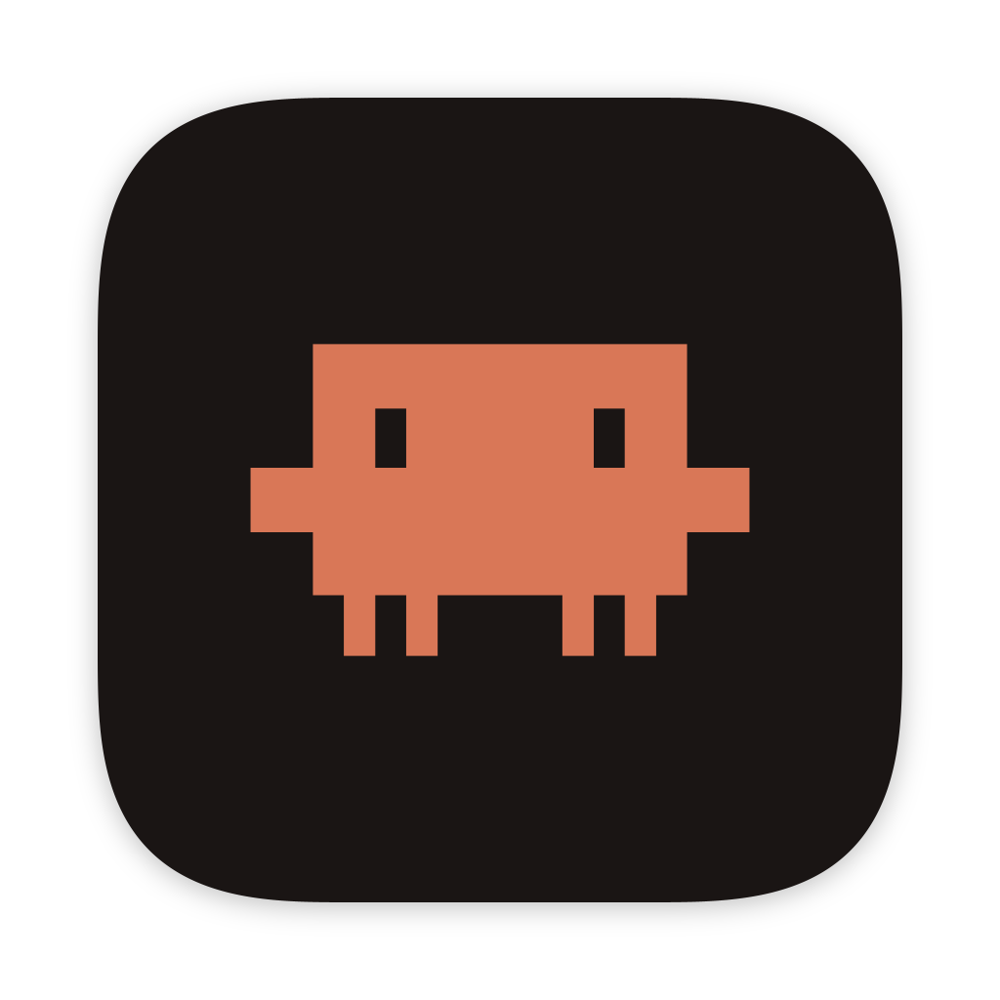

# Claude Code Usage



A macOS menu bar app that shows how much Claude Code you have left. The menu bar reads `5h 62% · 7d 41%`, the percentages left in the 5-hour and weekly windows, and refreshes itself every minute. Opening the menu shows those same remaining percentages with how long until each window resets, and from there you can open the window, force a refresh, or quit.

Team-signed builds also include a small macOS widget for the desktop and Notification Center. It follows the menu dropdown's selected 5-hour and weekly windows and its left/used percentage setting. Reset countdowns keep moving between refreshes, and clicking the widget opens the main window.

The window has the same two limits along the top, plus the Opus weekly window, which does not fit in the menu bar. Under them is a table of input, output, cache, and total tokens per day, week, month, session, and 5-hour block, summed from the JSONL transcripts in `~/.claude/projects`.

The Dock icon follows the window. While the window is up the app is a regular one, with a Dock tile, a Cmd-Tab entry, and its own menu bar. Closing the window parks it as an accessory, leaving the menu bar item as the only thing on screen.

Built with [GPUI](https://gpui.rs/) and [gpui-component](https://longbridge.github.io/gpui-component/). Unofficial, and not affiliated with Anthropic.

The limits come from Anthropic's OAuth usage endpoint. The app sends the token Claude Code already keeps in your login keychain, so there is no second login here. If there is no token, or the usage API rejects it with a 401, the window says "Not logged in" and drops any numbers it had been showing. Whether you are logged in is decided by the token, not by `claude auth status`, which can report a login after the token is dead.

Claude Code's access tokens last eight hours, and only Claude Code refreshes them. When the stored token is past its `expiresAt`, the app skips the request and says the session has expired rather than that you are logged out. The token tables stay up, and the limits come back on the first poll after Claude Code has run and stored a fresh token. The app never refreshes the token itself.

The header names your plan (`Max 20x plan`, `Team Standard plan`), read from the `subscriptionType` and `rateLimitTier` stored with the token, plus the seat tier in `~/.claude.json` for Team and Enterprise.

The 5-hour and weekly limits belong to a subscription. If Claude Code is billed per token instead, through an API key, an `ANTHROPIC_AUTH_TOKEN` gateway, or Bedrock, Vertex, or Foundry, there are no limits to show. The app asks `claude auth status --json` how Claude Code is being billed, because an API key in the environment outranks a claude.ai login that is still in the keychain. In that case the window shows the token tables without limit cards, and the menu bar reads `Claude: API billing`. A plan that reports no windows at all reads `Claude: no limits`.

A Finder-launched app gets launchd's PATH, and `zsh -l` does not read `.zshrc`, which is where the native installer, nvm, bun, pnpm, and mise add their directories. So the app reads PATH once from an interactive login shell (`$SHELL -ilc`), falls back to `launchctl getenv PATH`, and then checks the usual install directories (`~/.local/bin`, `~/.claude/local`, nvm, bun, volta, pnpm, mise, asdf, Homebrew). The same shell read also picks up the variables that decide how Claude Code authenticates (`ANTHROPIC_API_KEY`, `ANTHROPIC_AUTH_TOKEN`, `CLAUDE_CODE_OAUTH_TOKEN`, `CLAUDE_CODE_USE_BEDROCK`/`_VERTEX`/`_FOUNDRY`, `CLAUDE_CONFIG_DIR`). They are passed only to `claude auth status`, so its answer matches what a terminal would get. The lookup is in `src/cli.rs`.

That token is sent only to `https://api.anthropic.com/api/oauth/usage`. Transcripts stay on disk. There is no extra account, no telemetry, and no other server. The endpoint is not a public API, so a Claude Code update can change the shape of the response or stop accepting the request.

## Requirements

- macOS
- Rust 1.88 or newer (`rustup`), edition 2024
- [Claude Code](https://code.claude.com/), installed any way, and logged in
- Full Xcode for widget and release builds
- Xcode command line tools, with the Metal toolchain if the first build asks for it:

```sh
xcode-select --install
sudo xcode-select --switch /Applications/Xcode.app/Contents/Developer
xcodebuild -downloadComponent MetalToolchain
```

## Run

```sh
cargo run
```

GPUI and gpui-component are git dependencies pinned in `Cargo.toml`, so the first build clones both and compiles them. Expect it to take a while. `Cargo.lock` should be committed with the rest of the tree so everyone builds the same revisions.

```sh
cargo build --release
./target/release/claude-usage
```

Refresh from the header button or the menu bar. Closing the window leaves the app in the menu bar. Quit from there, or with Cmd-Q while the window has focus.

## Idling in the menu bar

Closing the window parks it rather than destroying it, and the app settles at about 0.3% CPU and a 64MB footprint, against 1.1% and 80MB with the window up.

Parking, rather than closing, is deliberate. GPUI leaks a window on teardown: `MetalRenderer::destroy` is a no-op and the layer's three drawables go with it, so every close-and-reopen costs another 28MB that never came back. Four cycles reached 171MB. Keeping the one window and taking it off screen holds that flat. While it is parked its drawables shrink to 1x1, which is what returns the 21.5MB of GPU surfaces, and `AppView` ignores store updates so nothing asks for a frame that will never be shown. A frame requested by a parked window is not free: it costs a CoreAnimation commit and an AppKit display cycle, which on its own was worth 2% CPU.

The limits are polled every minute with the window open and every five with it closed. Both intervals are in `src/store.rs`. The user agent needs `claude --version`, which can cost a shell start and a Node start, so it is read once per run rather than once per poll. When Claude Code is billed per token there is nothing to poll, so each tick only reruns `claude auth status`, which takes about a tenth of a second, and does a full reload once billing has switched back to a subscription.

## Widget

The widget does not fetch from Anthropic. The menu bar process writes the selected limits to `widget-snapshot.json` in a shared macOS App Group, then asks WidgetKit to reload when a visible value changes. The snapshot contains percentages, reset dates, display preferences, and the last successful fetch time. It contains no OAuth token and no transcript data.

WidgetKit schedules the actual render, so a tile can lag behind the menu bar. It also asks for a fresh snapshot every 30 minutes and renders reset dates as live SwiftUI date text. Keep Claude Code Usage running in the menu bar if you want the widget to receive new quota figures.

The extension needs a real Apple team identity for its App Group. `cargo run` still works without one. An ad-hoc bundle also works, but `scripts/bundle.sh` leaves the widget out and prints a warning rather than shipping a tile that cannot read its data.

The Rust and Swift tests are separate:

```sh
cargo test
xcodebuild \
  -project widget/ClaudeUsageWidget.xcodeproj \
  -scheme ClaudeUsageWidget \
  -derivedDataPath target/widget-test \
  CODE_SIGNING_ALLOWED=NO \
  HOST_BUNDLE_ID=com.example.claude-usage \
  APP_GROUP_ID=EXAMPLETEAM.com.example.claude-usage \
  test
```

## Distribution

`scripts/bundle.sh` builds `Claude Code Usage.app`, signs it with your Developer ID, and packs a disk image (plus a zip). Set your own identifiers first:

```sh
cp scripts/release.env.example scripts/release.env
```

Fill in a bundle id you own. `release.env` is ignored by git, and the script reads your signing certificate from your keychain, so nothing about your developer account is ever committed. Then:

```sh
sh scripts/bundle.sh
```

The script reads the team id from a normal `Developer ID Application: Name (TEAMID)` identity and uses `<TEAMID>.<BUNDLE_ID>` for the widget's macOS App Group. Set `TEAM_ID` in `release.env` only when `SIGN_IDENTITY` is a certificate hash or another value that does not carry the team id.

To notarize as well, create a notarytool profile once. It stores your app-specific password in your login keychain rather than in the repo:

```sh
xcrun notarytool store-credentials <profile> \
  --apple-id you@example.com --team-id <TEAM_ID> --password <app-specific>
```

Put that profile name in `release.env` as `NOTARY_PROFILE` and run the script again. The script notarizes and staples the app first, then puts that stapled copy in the DMG and notarizes the finished disk image.

### Cutting a release

Bump `version` in `Cargo.toml`, run `cargo build` so `Cargo.lock` picks the new version up, and commit both with the change they ship. Then bundle, tag, and publish:

```sh
sh scripts/bundle.sh                 # reads the version from Cargo.toml
V=$(sed -n '/^\[package\]/,/^\[/s/^version = "\(.*\)"/\1/p' Cargo.toml | head -1)

git push origin master
git tag -a "v$V" -m "v$V"
git push origin "v$V"

gh release create "v$V" --title "v$V" --notes "..." \
  "target/bundle/claude-usage-$V.dmg" \
  "target/bundle/claude-usage-$V.zip"
```

Bundle before tagging, so what ships is built from the commit the tag names. `xcrun stapler validate target/bundle/claude-usage-$V.dmg` confirms the notarization ticket made it into the disk image before you upload it.

The app is signed with the hardened runtime, which notarization requires. It stays outside App Sandbox because it runs the user's shell and the `claude` CLI and reads Claude Code's keychain item. Widget builds give the host only an App Group entitlement. The extension is sandboxed and can read only that shared group.

## Icon

The Claude Code mark is from [thesvg.org](https://thesvg.org/icon/claude-code) (MIT) and lives in `assets/app-icon.svg`. The refresh icon is [Lucide](https://lucide.dev)'s `rotate-cw` (ISC). To regenerate the bundle icon after editing the mark:

```sh
python3 scripts/make_icon.py
```

That renders the mark onto the macOS icon grid, an 824x824 rounded body inside a 1024x1024 canvas, and writes `assets/dock-icon.png`, the 1024 master the app hands AppKit for the Dock and the app switcher, plus `assets/AppIcon.icns`, which is what Finder shows on the bundle. Nothing rounds or insets the artwork on the way, so the padding, corner curve, and shadow have to be baked in or the icon sits larger than its neighbours. The corner and shadow constants in the script are fitted to the silhouette macOS applies to its own app icons, within 3px at 1024.

## License

This project's source is [ISC](LICENSE). GPUI and gpui-component are Apache-2.0. A git checkout of Zed currently also links GPL-3.0 tracing crates into the binary, which may apply if you redistribute a build.
